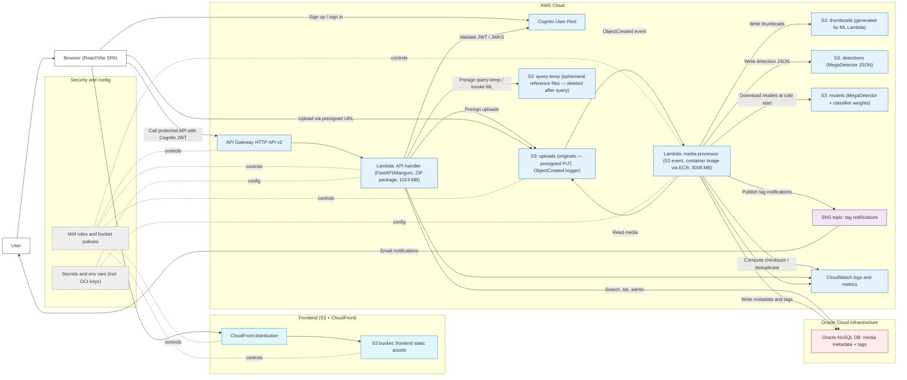

# Architecture diagram

The diagram below reflects the implemented AWS and OCI split: CloudFront serves the React/Vite static frontend from S3, Cognito handles authentication, API Gateway HTTP API v2 fronts the Lambda API, S3 event processing and ML inference run inside the ML processor Lambda (PyTorch and ml_pipeline bundled into a container image via ECR), and OCI hosts only the NoSQL metadata database.

**Access model**: EcoLens is a shared platform. Authentication (Cognito JWT) is required on every API call. All files are searchable and viewable by any registered user. Tag edits are also open to all authenticated users. **Deletion is owner-only** — `DELETE /media` enforces an ownership check and returns a `forbidden` list for files uploaded by other users. SNS notifications are delivered to all subscribers whose species watch-list matches the tags on any newly uploaded file, regardless of who uploaded it.

